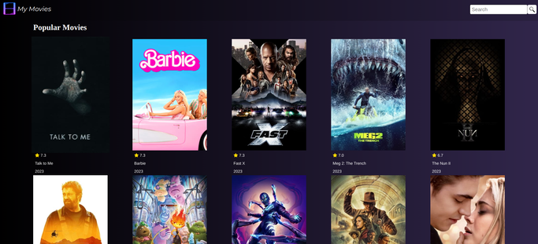
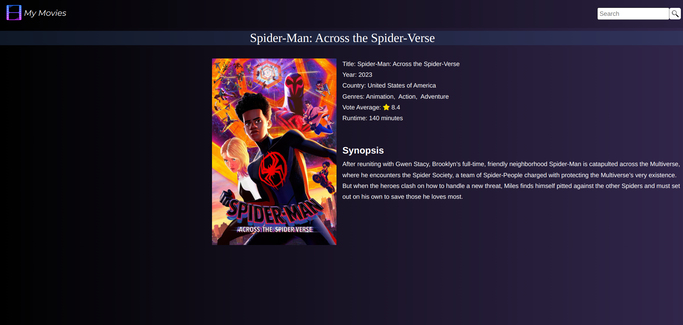
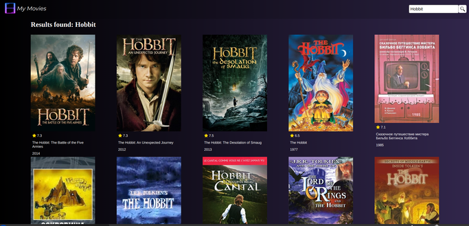

# <p align="center">My Movies</p>

[django]: https://docs.djangoproject.com/en/4.2/

[python]: https://docs.python.org/3/

[html]: https://developer.mozilla.org/en-US/docs/Web/HTML

[css]: https://developer.mozilla.org/en-US/docs/Web/CSS

[javascript]: https://developer.mozilla.org/en-US/docs/Web/JavaScript

[my_github]: https://github.com/Kalebe614

[my_porfolio]: https://kalebe614.github.io/

#### <p align="center">List of Movies Using an External API with Django. This application utilizes an external API provided by https://developer.themoviedb.org/"</p>

<p align="center">
  
  
  
</p>


## Contents

- [Technologies Used](#technologies-used)

- [Installation](#installation)

- [Credits](#credits)

- [Contact](#contact)

## Technologies Used

- [Python][python]
- [Django][django]
- [HTML][html]
- [CSS][css]
- [JavaScript][javascript]

  
## Installation

<p>1. Clone the repository:

```
git clone git@github.com:Kalebe614/my-movies.git
```

</p>

<p>
2. Navigate to the project directory:

```
cd my-movies
```
</p> 
 
<p>
3. Install the dependencies:

```
pip install -r requirements.txt
```
</p>

<p>
. Execute the project:

```
python manage.py runserver
```
</p>
<p>
Now you can open: http://localhost:8000 or http://127.0.0.1:8000 to view it in the browser.
</p>

## Credits
Quiz app was built by [Kalebe de Oliveira][my_porfolio]

## Contact
- Email: <a ref="mailto:kalebe613@gmail.com">kalebe613@gmail.com</a>
- [GitHub](https://github.com/Kalebe614)

